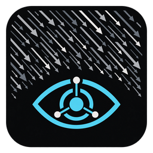

# SHADE 0.4.0 beta

**Source Harvesting, Attribution, Deduplication & Export**

> BE FREE // FIGHT IN THE SHADE



SHADE collects permitted public reports, preserves their evidence, and gives a
human operator a concise review inbox. It never controls radio software, keys
PTT, declares an emergency, or transmits. The software pipeline ends at
`TX_CANDIDATE`; `SENT` is only the operator's after-the-fact record.

## Desktop interface

Double-click **Open SHADE.vbs** to open the operator console. Collect, filter, review,
inspect sources, preview messages, and apply housekeeping using buttons and menus.
See the [desktop guide](docs/DESKTOP.md) for installation and everyday use.

## Install or upgrade

Python 3.11 or newer is required. For an existing installation, **do not run
`shade init` and do not replace config.toml**. See [Windows upgrade instructions](docs/UPGRADE.md).
For a new installation:

```powershell
python -m venv .venv
.\.venv\Scripts\python.exe -m pip install .\release\shade_node-0.4.0-py3-none-any.whl
.\.venv\Scripts\shade.exe init
```

Set your callsign, region and identifiable request contact in the private config.
The public examples contain placeholders. `config.local.toml` can add sources,
source packs, relevance policy and a request-contact override without changing
station identity or the database path. Do not enable packs twice in both files.

## Daily operator use

```powershell
shade --mode standard status
shade doctor
shade --mode standard run-once
shade inbox
shade inbox --lane context
shade now
shade inbox --category cyber --max-age 48 --limit 10
shade now --area REGIONAL --all
shade inbox --all --lane all --status EXPIRED
```

**ID is the claim ID**, not a list position. `queue` remains an alias for `inbox`.
The inbox shows age, geographic tier, category, significance, confidence,
independent originating family count, workflow state and title. The `context`
lane isolates fresh top-news prompts for a local-impact check. Local relevance
ranks first, then publication freshness, then score. `now` is the current local
life-safety weather lane and displays remaining validity. `--all` broadens
suppression filters but never makes expired warnings active in NOW.

```powershell
shade show 214
shade mark 214 review
shade format 214
shade bulletin --window 6h --min-score 35 --category cyber,top-news
shade mark 214 tx_candidate
# A licensed operator independently decides whether/how to transmit.
shade mark 214 sent
# Or, while permitted by the workflow:
shade mark 214 rejected
```

Use a real ID from your inbox in place of 214. Formatting requires REVIEW or
TX_CANDIDATE and does not transmit. `show` explains the score, attribution,
timestamps, every evidence URL and next valid workflow transitions.

`bulletin` is a read-only export for the evening operator workflow. It gathers
current REVIEW and TX_CANDIDATE items, ranks them with the normal queue policy,
splits them into numbered JS8 messages within the configured character limit,
and writes a plain-text train under `data/exports/` (or `--output`). It does not
change workflow state and never transmits.

## Relevance and freshness

Each evaluation reports geography, category, impact, freshness, source
confidence, corroboration, time sensitivity and operator-priority points. The
sum is clamped to 0..100. Eligibility gates are separate from the numeric score:
a high number never defeats an expiration, routine-weather or remote-earthquake
filter. This is a transparent heuristic, not a factual verification service.

Default tiers: ETN/WNC (30 points), broader TN/KY/GA/NC (20), relevant national
reports (12), global (0). Affected counties, not the issuing NWS office, establish
weather locality. The built-in county list is editable through `local_counties`.
National cyber, infrastructure, fuel, grid, communications, transport, supply
chain, public-health and public-safety reports need concrete operational impact.
Routine newsletters and announcements are retained but suppressed. Geography is
conservative; unknown or ambiguous locations do not become local by assumption.

Weather expiration uses the earlier valid `ends`/`expires`, plus cancellation,
onset, urgency and certainty. Missing expiration is not treated as active.
Tornado/flash-flood and explicit life-safety warnings are shown locally by
default; fog and special-weather statements require a broad NOW view.

Earthquakes use structured USGS magnitude, coordinates, significance, felt,
alert level and tsunami-product flag. Southeast M3.5+ events, consequential
domestic events, global M7.5+ or orange/red impact alerts may qualify. A USGS
tsunami flag alone does not establish an ongoing tsunami threat. Remote M6.x
reports stay in evidence storage. Legacy GDACS quakes lacking structured impact
metadata remain suppressed; this version does not infer casualties from titles.

`[relevance]` in either configuration file controls thresholds, county/place
lists and category priority adjustments. See the examples. Scores are recomputed
from original evidence at query time so they cannot become stale cached facts.

## Evidence and housekeeping

Original observation rows are immutable. Changed source records are stored as
separate revisions. Repeated identical input is not inserted again. Reposts
must share the originating `source_family`; two URLs do not establish two
independent sources. Community-only single-family reporting is `UNVERIFIED`.
Confidence labels describe attribution, not certainty about an event.

Correlation uses exact source-family event IDs, or conservative exact normalized
multiword titles with equal location and a six-hour time window. Weather,
earthquakes, space weather and generic disaster titles never use fuzzy merging.
Existing claim IDs and legacy correlations are preserved; each underlying
observation is evaluated for active validity. Old false groupings are not
silently rewritten, and uncertain cross-source reports may remain separate.

```powershell
shade migrate
shade housekeep
shade housekeep --suppress
shade housekeep --suppress --apply
```

Migration creates a verified SQLite backup before legacy schema changes and
classifies ended items EXPIRED. Re-running it is safe. Housekeeping defaults to
a preview; `--apply` is explicit confirmation and creates a backup. It never
deletes evidence. Suppression only changes NEW claims; reviewed claims are not
bulk rejected. EXPIRED blocks manual workflow advancement; a newly received source validity extension may reactivate it as NEW with an audit entry. SUPPRESSED may return to REVIEW. Active
views enforce expiration even without housekeeping or a scheduled job.

## Sources and modes

See [source attribution and limits](docs/SOURCES.md), the
[local chatter/top-news strategy and nightly workflow](docs/SOURCE_STRATEGY.md),
[EmComm profiles](docs/EMCOMM.md), and [Windows scheduling](docs/SCHEDULING.md).
Network requests are HTTPS only,
bounded by timeout/size, with persistent per-source cooldown and error backoff.
A scheduled 15-minute run can skip sources whose hourly cooldown has not elapsed.
FAA, TDOT, and vendor incident snapshots expire after 30 minutes without a successful
refresh; disappearance from a successful complete snapshot ends that item.

STANDARD excludes EmComm-only feeds. EXERCISE marks both ends of traffic.
ACTUAL formatting requires `--confirm-actual`. Scheduled runs must explicitly
use `--mode standard`, which overrides any mode persisted in private config.

## Development and release

```powershell
python -m pip install -e .
python -m unittest discover -s tests -v
python tools/build_release.py
```

Tests use local fixtures only. Release building stages an allowlisted source
copy, builds a wheel, and creates a clean ZIP. Private configuration, databases,
virtual environments, caches, old packaging metadata and prior build products
are excluded. Brand assets are preserved unchanged. The public repository
identity is `TheKnightmare/SHADE`; building does not publish or push anything.

